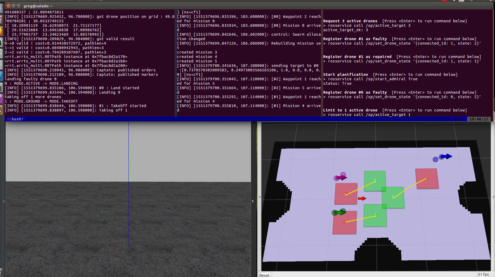

# Multi-crazyflie zone surveillance
ENSTA Super-project, 2018-2019
License: LGPLv3

## Overview

This project aims at building a ROS software stack able to coordinate the flight of multiple drones (bitcraze Crazyflie) over a target area, in order to cover it as a surveillance system would. 

This repo contains the code for this project, that encompasses:
- long-term drone placement
- trajectory planning
- control and drone avoidance
- hot replacement of faulty drones

## Full Documentation

The full documentation and installation instructions are available [**in the wiki**](https://github.com/Arpafaucon/sp/wiki).
